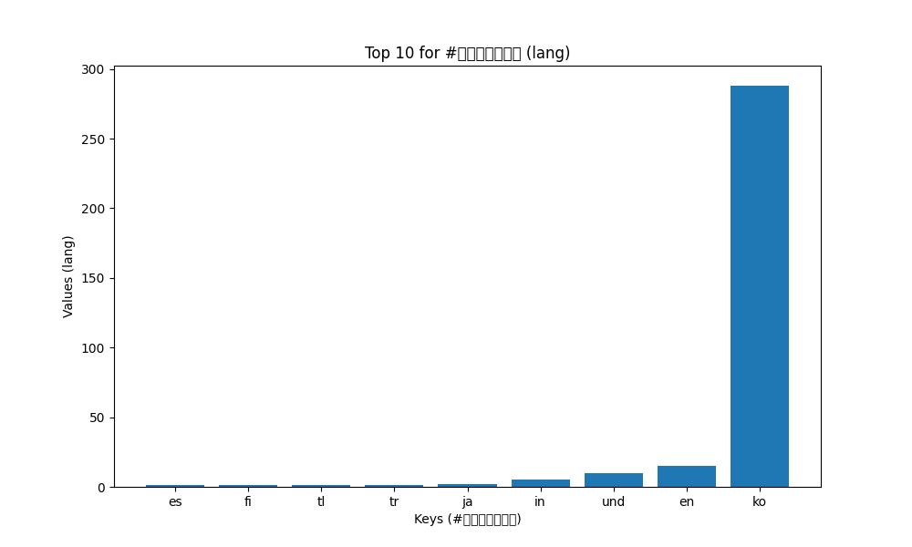

# Twitter Coronavirus Hashtag Analysis
This project analyzes the use of different hashtags related to Covid-19 / Coronavirus throughout 2020. This data is parsed and aggregated using `src/map.py` and `src/reduce.py`, which is saved into the `combined_outputs.json` file. The visualizations are generated using the `src/visualize.py` and `src/alternative_reduce.py` algorithms. This analysis takes into account mostly English, but also some non-English (for example, #코로나바이러스) hashtags, however, the unicode characters caused some issues with display in the visualziations. This analysis gives insight into global engagement and trends about the pandemic. 

## Visualizations

These visualizations are generated using `src/visualize.py`. This command takes in an input hashtag and uses either the `combined_outputs/all_lang.json` or `combined_outputs/all_country.json` files. An example input for this command would be:
```src
./src/visualize.py --input_path=combined_outputs/all_lang.json --key=#코로나바이러스
```
This plots the results into a bar chart and displays the top 10 countries or languages that tweeted the inputted hashtag. I had some issues with getting it to display the correct axes labels and titles, but the data is correct.

Here's an example for #coronavirus, measuring by country:

As you can see, the axes and title don't really allign with what the data displays -- the keys represent the country, and the values represent the count of tweets. The United States had by far the most tweets using #coronavirus, folowed by India and Britain.

This visualization measures the same hashtag, #coronavirus, but counts by language instead of country. The axes on this one are a little more relevant, with keys being the language and values being the count.

The most used language for #coronavirus was English, with Spanish and 'und' (other) following. 

This visualizer also supports other languages -- however, matplotlib has issues with displaying unicode / not-ascii characters. Trying to change the font to one that supported this gave me enough trouble to accept the ugly labelling.
Here is the tweets by country for #코로나바이러스:

Korea used this hashtag the most, followed by Hong Kong.

And here is the same hashtag, #코로나바이러스, counted by language:

the most popular language used for this hashtag was Korean, followed by English.
##
